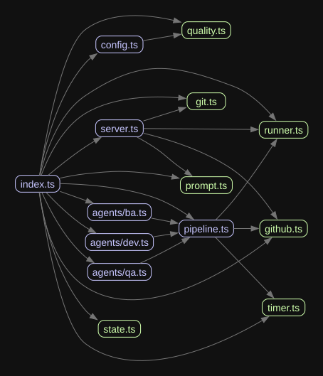

# mouse-fixes

**mouse-fixes** is a zero-touch CLI that takes a GitHub issue number, hands it to Claude Code,
and gets back a merged-ready pull request — branch created, code fixed, PR opened — with no human
in the loop.

Lightweight CLI that takes a GitHub issue number, asks Claude Code to fix it **and** run the full git workflow (branch → commit → push → PR) — all autonomously, from your terminal.

## How it works
[How it works - article](https://www.linkedin.com/pulse/i-built-claude-agent-turns-github-issues-pull-heres-myshkovskaya-fbr3f/)
1. **Read issue** — fetches title, body, and labels from GitHub
2. **Fix code** — Claude reads the relevant files and implements a minimal fix
3. **Create branch** — `fix/{number}-{slug}` branched from master
4. **Push changes** — commits and pushes to origin
5. **Create PR** — opens a pull request with a structured description

## Requirements

- Node.js 18+
- [`gh`](https://cli.github.com/) — authenticated with your GitHub account, or `GITHUB_TOKEN` set in your environment
- [`claude`](https://claude.ai/code) — Claude Code CLI installed and logged in
- Run from inside a local clone of the target git repository

## Installation

```bash
npm install -g mouse-fixes
```

## Usage

```bash
# From inside any git repo
mouse-fixes 38
mouse-fixes https://github.com/owner/repo/issues/38
mouse-fixes 49 --timeout 300
```

> **Tip:** Run from **Git Bash** (not PowerShell or Claude Code's built-in terminal) to see the full live output. Other terminals may truncate the streaming log to the last few lines.

## When to use mouse-fixes vs. Claude Code directly

Token consumption for the same task is roughly equal either way — an agentic session that reads 10 files and makes 5 edits uses the same tokens whether you type the request interactively or trigger it via this CLI. The template prompt adds a minor ~750-token overhead per run.

The difference is **who needs to be at the keyboard**:

| Scenario | Use mouse-fixes | Use Claude Code directly |
|---|---|---|
| You are away from your computer | ✓ | — |
| You want to fix several issues in parallel terminals | ✓ | — |
| You want it triggered from a CI pipeline or webhook | ✓ | — |
| You want a scheduled overnight batch run | ✓ | — |
| You are already in Claude Code and want one issue fixed | — | ✓ better |

**If you are sitting at your computer**, direct Claude Code is often the better choice: you can steer Claude if it goes down a wrong path (saving tokens and time), ask clarifying questions, and pick your own branch name and PR style on the fly.

mouse-fixes pays off when its core feature — **zero human involvement** — is what you actually need.

## GitHub Actions (event-driven, no server needed)

The `autofix` label triggers an automated fix run on any issue. Copy the example workflow into your repo:

```bash
mkdir -p .github/workflows
curl -o .github/workflows/autofix.yml \
  https://raw.githubusercontent.com/ZhannaM85/mouse-fixer/main/.github/workflows/autofix.yml
```

**Required secrets** — add these in your repo under Settings → Secrets → Actions:

| Secret | Where to get it |
|---|---|
| `ANTHROPIC_API_KEY` | [console.anthropic.com](https://console.anthropic.com) → API Keys |
| `GITHUB_TOKEN` | Automatically provided by GitHub Actions — no setup needed |

**Usage:** Open an issue in your repo and add the `autofix` label. The workflow starts automatically and posts a PR link in the Actions log when done.

**Note:** API calls are billed to your Anthropic account. Each run costs roughly the same as asking Claude to fix the issue interactively.

## What it does

| Step | Description |
|------|-------------|
| Detect repository | Reads `owner/repo` from `git remote get-url origin` |
| Fetch GitHub issue | Pulls title, body, and labels via `gh issue view` |
| Claude fix + git + PR | Claude reads the issue, implements the fix, creates `fix/{number}-{slug}` branch, commits, pushes, and opens the PR — all via its Bash tool |

Claude handles the entire workflow so it works whether invoked via this CLI or through an interactive Claude Code session.

## Stats report

Every run prints a timing table and a token/code summary at the end:

```
┌──────────────────────────┬──────────┬─────────────────────────────────────┐
│ Step                     │ Duration │ Detail                              │
├──────────────────────────┼──────────┼─────────────────────────────────────┤
│ Detect repository        │    0.1 s │                                     │
│ Fetch GitHub issue       │    0.4 s │                                     │
│ Claude fix + git + PR    │  142.3 s │                                     │
├──────────────────────────┼──────────┼─────────────────────────────────────┤
│ TOTAL                    │  145.3 s │                                     │
└──────────────────────────┴──────────┴─────────────────────────────────────┘

┌──────────────────────────────┬───────────────────────────────────────────────┐
│ Token & Code Stats           │                                               │
├──────────────────────────────┼───────────────────────────────────────────────┤
│ Input tokens (billed)        │ 45,230  (~820 prompt overhead)                │
│ Output tokens                │  3,412                                        │
│ Cache read tokens            │ 38,100  (84% of input)                        │
│ Cache write tokens           │  7,130                                        │
│ Tool calls                   │ 47                                            │
│ Estimated cost               │ $0.0423                                       │
├──────────────────────────────┼───────────────────────────────────────────────┤
│ Lines added                  │ +127                                          │
│ Lines deleted                │ -43                                           │
└──────────────────────────────┴───────────────────────────────────────────────┘

https://github.com/owner/repo/pull/71
```

**Cache read %** is the efficiency signal: a high percentage (>70%) means Claude's prompt caching is working well and subsequent turns are cheap. A low percentage means most tokens are billed at the full input rate.

## Cost

A typical run costs **$0.05–$2** depending on codebase size and session length. The range is wide because Claude reads however many files it needs to understand the issue — a small targeted fix on a focused repo lands near the low end; a sprawling codebase with many context files drifts toward the high end.

Prompt caching keeps repeat runs cheap: once Claude has read the main source files in a session, subsequent turns reuse the cached context at ~10% of the normal input token rate. The "Cache read %" line in the stats report shows how effectively caching is working for each run.

## Behaviour on edge cases

| Situation | Outcome |
|-----------|---------|
| Issue not found | Error printed, exits before touching git |
| Not in a git repo | Error printed, exits immediately |
| Claude times out | Warning printed; whatever Claude managed to do is left in place |

## Project structure



| File | Role |
|------|------|
| `src/index.ts` | CLI entry point — parses arguments, loads config, orchestrates all commands |
| `src/runner.ts` | Spawns the `claude` process, streams JSON output, returns results and usage stats |
| `src/github.ts` | Thin wrappers around the `gh` CLI — fetches issues, PRs, and diffs |
| `src/git.ts` | Preflight checks, repo detection, worktree create/remove, diff stats |
| `src/prompt.ts` | Builds the standard single-agent prompt given to Claude |
| `src/config.ts` | Loads `.mouse-fixes.yml` from the repo root |
| `src/state.ts` | Persists run state to `.mouse-fixes/state/<N>.json` |
| `src/timer.ts` | Step timing and the token/cost stats table printed at the end of each run |
| `src/quality.ts` | Runs lint/typecheck/test/build before opening a PR (`--quality` flag) |
| `src/server.ts` | HTTP server for Slack, Telegram, and generic webhook triggers |
| `src/pipeline.ts` | Orchestrates the multi-agent BA → Dev → QA chain (`--pipeline` flag) |
| `src/agents/ba.ts` | Business Analyst prompt — analyses the issue and produces acceptance criteria |
| `src/agents/dev.ts` | Developer prompt — implements the fix using BA output as a guide |
| `src/agents/qa.ts` | QA prompt — reviews the diff against acceptance criteria, read-only |

## Operating modes

| Mode | Command | What happens |
|------|---------|--------------|
| **fix** | `mouse-fixes 42` | Single Claude run → branch → commit → push → PR |
| **pipeline** | `mouse-fixes 42 --pipeline` | BA analyses the issue → Dev fixes it → QA reviews the diff |
| **serve** | `mouse-fixes serve` | HTTP server accepts Slack, Telegram, and webhook triggers |
| **watch** | `mouse-fixes --watch` | Polls GitHub for new labelled issues and auto-fixes them |
| **next** | `mouse-fixes next` | Picks the next open issue from `docs/issues-priority.md` and fixes it |
| **resume** | `mouse-fixes resume` | Continues the most recent interrupted run |
| **start** | `mouse-fixes start` | Bootstraps `docs/issues-priority.md` from all open GitHub issues |
| **review** | `mouse-fixes review 42` | Fetches a PR and outputs a structured code review |

## Serve mode

`mouse-fixes serve` starts a long-running HTTP server that listens for webhooks from Slack or Telegram and triggers a fix run for whichever issue number is passed in the message.

### Starting the server

```bash
mouse-fixes serve           # default port 3000
mouse-fixes serve --port 8080
```

### Exposing the server with ngrok (local development)

For local testing you need a public HTTPS URL. [ngrok](https://ngrok.com/) is the quickest way:

```bash
ngrok http 3000
# → https://abc123.ngrok.io
```

Use the printed `https://` URL as `<your-url>` in the setup steps below.

### Slack setup

1. Go to [api.slack.com/apps](https://api.slack.com/apps) → **Create New App**
2. Add a **Slash Command**: `/fix` pointing to `https://<your-url>/slack`
3. Copy the **Signing Secret** from **Basic Information**
4. Set the environment variable:
   ```bash
   export SLACK_SIGNING_SECRET=<value>
   ```
5. Reinstall the app to your workspace

**Usage:** type `/fix 42` in any channel to trigger a fix for issue #42.

### Telegram setup

1. Open Telegram → search **@BotFather** → send `/newbot` and follow the prompts
2. Copy the bot token BotFather gives you
3. Set the environment variable:
   ```bash
   export TELEGRAM_BOT_TOKEN=<value>
   ```
4. Register the webhook so Telegram forwards messages to your server:
   ```bash
   curl -X POST "https://api.telegram.org/bot<TOKEN>/setWebhook" \
     -d "url=https://<your-url>/telegram"
   ```
5. Start a chat with your bot and send `/fix 42`

### Environment variables

| Variable | Required for | Where to get it |
|---|---|---|
| `SLACK_SIGNING_SECRET` | Slack | Slack App → Basic Information |
| `TELEGRAM_BOT_TOKEN` | Telegram | @BotFather → `/newbot` |
| `ANTHROPIC_API_KEY` | GitHub Actions only | console.anthropic.com |
| `GITHUB_TOKEN` | GitHub Actions only | Actions secret (auto-provided) |

This Readme keeps being updated based on the chages in the code.
