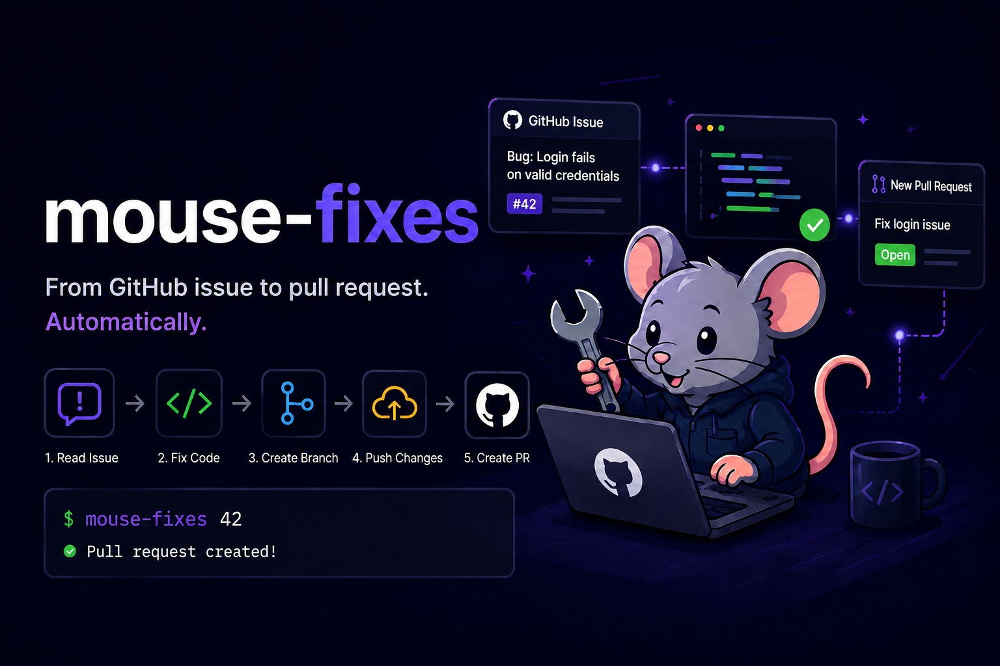

# mouse-fixes

**mouse-fixes** is a zero-touch CLI that takes a GitHub issue number, hands it to Claude Code,
and gets back a merged-ready pull request — branch created, code fixed, PR opened — with no human
in the loop.

Lightweight CLI that takes a GitHub issue number, asks Claude Code to fix it **and** run the full git workflow (branch → commit → push → PR) — all autonomously, from your terminal.

## How it works
(https://www.linkedin.com/pulse/i-built-claude-agent-turns-github-issues-pull-heres-myshkovskaya-fbr3f/)
1. **Read issue** — fetches title, body, and labels from GitHub
2. **Fix code** — Claude reads the relevant files and implements a minimal fix
3. **Create branch** — `fix/{number}-{slug}` branched from master
4. **Push changes** — commits and pushes to origin
5. **Create PR** — opens a pull request with a structured description

## Requirements

- Node.js 20+
- [`gh`](https://cli.github.com/) — authenticated with your GitHub account, or `GITHUB_TOKEN` set in your environment
- [`claude`](https://claude.ai/code) — Claude Code CLI installed and logged in
- Run from inside a local clone of the target git repository

## Usage

```bash
# Install once (from the mouse-fixes directory)
cd path/to/mouse-fixes && npm link

# Then from inside any repo
cd path/to/your-repo
mouse-fixes 38
mouse-fixes https://github.com/owner/repo/issues/38
mouse-fixes 49 --timeout 300
```

> **Tip:** Run from **Git Bash** (not PowerShell or Claude Code's built-in terminal) to see the full live output. Other terminals may truncate the streaming log to the last few lines.

## When to use mouse-fixes vs. Claude Code directly

Token consumption for the same task is roughly equal either way — an agentic session that reads 10 files and makes 5 edits uses the same tokens whether you type the request interactively or trigger it via this CLI. The template prompt adds a minor ~750-token overhead per run.

The difference is **who needs to be at the keyboard**:

| Scenario | Use mouse-fixes | Use Claude Code directly |
|---|---|---|
| You are away from your computer | ✓ | — |
| You want to fix several issues in parallel terminals | ✓ | — |
| You want it triggered from a CI pipeline or webhook | ✓ | — |
| You want a scheduled overnight batch run | ✓ | — |
| You are already in Claude Code and want one issue fixed | — | ✓ better |

**If you are sitting at your computer**, direct Claude Code is often the better choice: you can steer Claude if it goes down a wrong path (saving tokens and time), ask clarifying questions, and pick your own branch name and PR style on the fly.

mouse-fixes pays off when its core feature — **zero human involvement** — is what you actually need.

## What it does

| Step | Description |
|------|-------------|
| Detect repository | Reads `owner/repo` from `git remote get-url origin` |
| Fetch GitHub issue | Pulls title, body, and labels via `gh issue view` |
| Claude fix + git + PR | Claude reads the issue, implements the fix, creates `fix/{number}-{slug}` branch, commits, pushes, and opens the PR — all via its Bash tool |

Claude handles the entire workflow so it works whether invoked via this CLI or through an interactive Claude Code session.

## Stats report

Every run prints a timing table and a token/code summary at the end:

```
┌──────────────────────────┬──────────┬─────────────────────────────────────┐
│ Step                     │ Duration │ Detail                              │
├──────────────────────────┼──────────┼─────────────────────────────────────┤
│ Detect repository        │    0.1 s │                                     │
│ Fetch GitHub issue       │    0.4 s │                                     │
│ Claude fix + git + PR    │  142.3 s │                                     │
├──────────────────────────┼──────────┼─────────────────────────────────────┤
│ TOTAL                    │  145.3 s │                                     │
└──────────────────────────┴──────────┴─────────────────────────────────────┘

┌──────────────────────────────┬───────────────────────────────────────────────┐
│ Token & Code Stats           │                                               │
├──────────────────────────────┼───────────────────────────────────────────────┤
│ Input tokens (billed)        │ 45,230  (~820 prompt overhead)                │
│ Output tokens                │  3,412                                        │
│ Cache read tokens            │ 38,100  (84% of input)                        │
│ Cache write tokens           │  7,130                                        │
│ Tool calls                   │ 47                                            │
│ Estimated cost               │ $0.0423                                       │
├──────────────────────────────┼───────────────────────────────────────────────┤
│ Lines added                  │ +127                                          │
│ Lines deleted                │ -43                                           │
└──────────────────────────────┴───────────────────────────────────────────────┘

https://github.com/owner/repo/pull/71
```

**Cache read %** is the efficiency signal: a high percentage (>70%) means Claude's prompt caching is working well and subsequent turns are cheap. A low percentage means most tokens are billed at the full input rate.

## Cost

A typical run costs **$0.05–$2** depending on codebase size and session length. The range is wide because Claude reads however many files it needs to understand the issue — a small targeted fix on a focused repo lands near the low end; a sprawling codebase with many context files drifts toward the high end.

Prompt caching keeps repeat runs cheap: once Claude has read the main source files in a session, subsequent turns reuse the cached context at ~10% of the normal input token rate. The "Cache read %" line in the stats report shows how effectively caching is working for each run.

## Behaviour on edge cases

| Situation | Outcome |
|-----------|---------|
| Issue not found | Error printed, exits before touching git |
| Not in a git repo | Error printed, exits immediately |
| Claude times out | Warning printed; whatever Claude managed to do is left in place |

This Readme keeps being updated based on the chages in the code.
