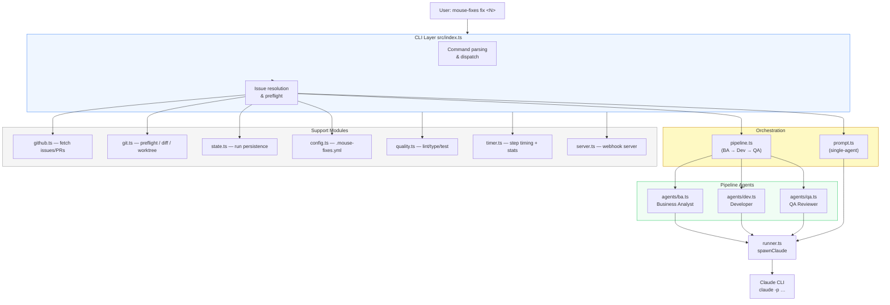
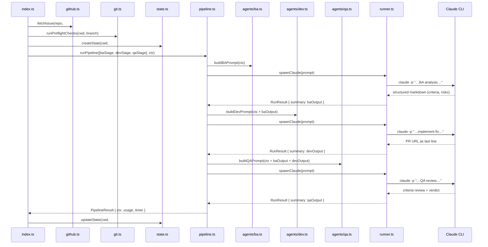

# mouse-fixes — Architecture

This document explains what every file does, why it exists, and how the pieces connect. Updated after each significant change.

---

## System Overview

mouse-fixes is a CLI that spawns Claude sub-agents to autonomously fix GitHub issues. In `--pipeline` mode it runs three sequential agents (BA → Dev → QA); in default mode it runs a single agent. Either way, the sub-agent does the actual work — mouse-fixes handles issue discovery, orchestration, timing, and state persistence.



---

## Data Flow — Standard Fix Run



---

## Module Reference

### `src/index.ts`
**Why it exists:** CLI entry point and orchestrator. Parses command-line arguments, dispatches to the right command handler, and wires together every other module. Everything that doesn't fit neatly into a focused module lives here.

| Function / Export | Purpose |
|-------------------|---------|
| `parseIssueNumber(raw)` | Accepts either a raw number (`"11"`) or a GitHub URL (`"…/issues/11"`). Exits with an error message on invalid input. |
| `resolveNextIssue(cwd, branchPrefix)` | Reads `docs/issues-priority.md`, skips strikethrough lines and issues with open PRs, and returns the next unfixed issue number. Used by `start` / `watch` modes. |
| `fixIssue(n, opts)` | Full fix workflow for a single issue: fetch → preflight → branch → choose prompt strategy (default / dry-run / worktree / approve / pipeline) → `spawnClaude` or `runPipeline` → quality checks → state update → timer report. |
| `markIssueDone(cwd, n)` | Applies strikethrough to the issue row in `docs/issues-priority.md` and commits + pushes the change. Called by `start` / `watch` after a successful fix. |
| `findResumableSessions(cwd)` | Scans `.mouse-fixes/state/` for runs in `claude-running` stage and returns their issue numbers. Used by the `resume` command. |
| `buildWorktreePrompt(...)` | Prompt variant for `--worktree` mode — tells Claude to work in the provided worktree path and not switch branches. |
| `buildApproveBeforePushPrompt(...)` | Prompt variant that pauses before `git push` and waits for approval. |
| `buildApproveBeforePrPrompt(...)` | Prompt variant that pauses before `gh pr create` and waits for approval. |

**Commands handled:** `fix`, `start`, `watch`, `resume`, `serve`, `review`, `reset-state`.

---

### `src/runner.ts`
**Why it exists:** The only module that knows how to invoke the Claude CLI. Spawns `claude -p <prompt> --output-format stream-json`, streams JSON events line by line, formats live progress output, accumulates token/cost stats, and returns a structured `RunResult`. All other modules stay decoupled from the Claude CLI binary format.

| Export | Purpose |
|--------|---------|
| `UsageStats` | Token counts + estimated cost for one Claude run. Accumulated across pipeline stages in `pipeline.ts`. |
| `spawnClaude(prompt, cwd, timeoutMs, model, maxTurns, prefix, sessionName)` | Spawns the Claude CLI process, streams `assistant` / `tool_use` / `tool_result` / `result` events, renders live tool call progress to stdout, detects `max_turns_reached` and process errors, and returns `RunResult`. |
| `runPostMortem(cwd, outputLog)` | Spawns a secondary Claude session to diagnose what went wrong in a failed run. Used by `fixIssue` when a run times out or hits max turns. |

**Event handling:** Uses `--output-format stream-json` which emits one JSON object per line. `tool_use` events are formatted by `formatToolCall()` for live display (e.g. `Read        runner/src/runner.ts`). The final `result` event carries the text summary and usage stats.

---

### `src/pipeline.ts`
**Why it exists:** Runs the three-agent BA → Dev → QA sequence. Separating pipeline orchestration from `index.ts` keeps the multi-agent logic isolated — `runPipeline` doesn't know anything about CLI flags or state files.

| Export | Purpose |
|--------|---------|
| `PipelineContext` | Shared mutable bag passed between stages: repo, issue, branches, and the output of each completed stage (`baOutput`, `devOutput`, `qaOutput`). |
| `PipelineStage` | Interface: `{ name, buildPrompt(ctx), storeOutput?(ctx, output) }`. Each agent module exports one stage. |
| `PipelineResult` | Return value: the final `ctx`, cumulative `UsageStats`, per-stage usage, `StepTimer`, and `failedStage` if a stage stopped early. |
| `runPipeline(stages, ctx, timeoutMs, ...)` | Iterates stages in order. For each: calls `buildPrompt`, calls `spawnClaude`, accumulates usage, calls `storeOutput` to inject the result into `ctx` for the next stage. Stops and returns early if any stage times out or errors. |

---

### `src/agents/ba.ts`
**Why it exists:** Business Analyst stage. Gives Claude a structured analysis task focused purely on understanding the issue — not implementing it. The structured output (problem statement, acceptance criteria, risks) is passed to the Dev stage so the developer agent has a clearer implementation target than the raw GitHub issue body.

| Export | Purpose |
|--------|---------|
| `buildBAPrompt(ctx)` | Builds the BA prompt. Adds a label hint for `bug` vs `enhancement` issues and flags under-specified issues (body < 100 chars). Instructs Claude to output only structured markdown — no preamble. |
| `baStage` | `PipelineStage` object wiring `buildBAPrompt` and a `storeOutput` that saves the result to `ctx.baOutput`. |

---

### `src/agents/dev.ts`
**Why it exists:** Developer stage. Takes the BA analysis plus the original issue and instructs Claude to implement the fix, run the git workflow, and open a PR. The explicit git instructions prevent Claude from skipping the commit/push steps.

| Export | Purpose |
|--------|---------|
| `buildDevPrompt(ctx)` | Builds the developer prompt with: branch setup (step 1), implementation (step 2), ARCHITECTURE.md update if the file exists (step 2.5), git workflow (step 3), and return to default branch (step 4). Injects `baOutput` as the implementation guide. |
| `devStage` | `PipelineStage` wiring `buildDevPrompt` and a `storeOutput` that saves the PR URL to `ctx.devOutput`. |

---

### `src/agents/qa.ts`
**Why it exists:** QA Reviewer stage. Inspects the changes Claude made (via `git diff`) against the acceptance criteria from the BA stage. Produces a pass/fail verdict that appears in the PR body, giving reviewers immediate confidence signal.

| Export | Purpose |
|--------|---------|
| `buildQAPrompt(ctx)` | Read-only review prompt. Instructs Claude NOT to modify files — only read and report. Maps each acceptance criterion to ✅/⚠️/❌. |
| `qaStage` | `PipelineStage` wiring `buildQAPrompt` and a `storeOutput` that saves the verdict to `ctx.qaOutput` and prints a warning if the verdict is `NEEDS WORK`. |
| `appendQASection(prBody, qaOutput)` | Appends (or replaces) a `## QA Review` section in the PR body string. Used by `index.ts` when updating the PR description after the QA stage. |

---

### `src/prompt.ts`
**Why it exists:** The single-agent prompt used in default mode (no `--pipeline`). Mirrors the structure of `buildDevPrompt` but without the BA context injection — intended for straightforward issues that don't need multi-agent decomposition.

| Export | Purpose |
|--------|---------|
| `buildPrompt(repo, issue, defaultBranch, branch)` | Builds a self-contained fix prompt with the same 4-step structure as `buildDevPrompt`: branch setup, implement, ARCHITECTURE.md update (if present), git workflow, return to default branch. |

---

### `src/github.ts`
**Why it exists:** All GitHub API calls go through `gh` CLI (not direct HTTP) — no PAT management, no OAuth flow. This module is the only place that knows the `gh` command format.

| Export | Purpose |
|--------|---------|
| `fetchIssue(repo, n)` | Fetches issue number, title, body, and labels via `gh issue view`. |
| `fetchAllIssues(repo)` | Fetches up to 200 open issues for `watch` mode's continuous polling loop. |
| `fetchPR(repo, n)` | Fetches PR metadata including head/base branch names and URL. |
| `fetchPRDiff(repo, n)` | Returns the raw unified diff of a PR via `gh pr diff`. Used by the `review` command. |

---

### `src/git.ts`
**Why it exists:** All git operations except Claude's own commits are performed here. Centralising them makes it straightforward to test preflight logic and diff analysis without touching the repository.

| Export | Purpose |
|--------|---------|
| `detectRepo()` | Parses `git remote get-url origin` to extract `owner/repo`. Handles both SSH and HTTPS URL formats. |
| `detectDefaultBranch()` | Reads `refs/remotes/origin/HEAD` to find the default branch; falls back to testing `main` / `master`. |
| `slugify(title, maxLen)` | Creates a branch-safe slug from an issue title (lowercase, hyphens, max 40 chars). |
| `runPreflightChecks(cwd, branch)` | Runs 5 safety checks before spawning Claude: uncommitted changes, detached HEAD, branch collision, unpushed commits on a protected branch, remote reachability. Returns an array of errors. |
| `getChangedFiles(cwd, ref, defaultBranch)` | Lists files changed between the given ref and the merge base with the default branch. |
| `getGitDiffStats(cwd, ref, defaultBranch)` | Returns `{ linesAdded, linesDeleted }` for the diff. Used in the session stats table. |
| `createWorktree(cwd, path, branch)` | Creates a git worktree for `--worktree` mode. |
| `removeWorktree(cwd, path)` | Best-effort cleanup of a worktree after the fix completes. |

---

### `src/state.ts`
**Why it exists:** Persists run state to `.mouse-fixes/state/<N>.json` so interrupted runs can be resumed and the watch-mode loop doesn't re-process completed issues.

| Export | Purpose |
|--------|---------|
| `RunState` | Full run record: issue number, branch, repo, stage, timestamps, model, PR URL, cost, failure reason, output log, post-mortem diagnosis, issue suggestions. |
| `RunStage` | Union of lifecycle stages: `pending` → `fetching-issue` → `claude-running` → `done` / `failed`. |
| `FailureReason` | Typed failure causes: `timedOut`, `maxTurnsReached`, `error`, `costExceeded`, `qualityFailed`. |
| `createState(cwd, n, repo, model, maxTurns)` | Creates a new state file in `pending` stage. |
| `updateState(cwd, n, stage, partial)` | Merges `partial` fields into the state file and advances the stage. |
| `readState(cwd, n)` | Returns the current state or `null` if no file exists. |
| `deleteState(cwd, n)` | Removes the state file on successful completion. |
| `loadState(cwd)` / `saveState(cwd, state)` | Read/write `.mouse-fixes-state.json` — the watch-mode persistence file tracking which issues have been processed in the current session. |

---

### `src/config.ts`
**Why it exists:** Loads `.mouse-fixes.yml` from the project root. Provides a zero-config path (no file = all defaults) while allowing per-project overrides without touching CLI flags.

| Export | Purpose |
|--------|---------|
| `MouseFixesConfig` | Typed config shape: `model`, `maxTurns`, `maxCost`, `maxConcurrent`, `defaultBaseBranch`, `branchPrefix`, `logDir`, `autoMerge`, `worktree`, `quality`. |
| `CONFIG_FILENAME` | `".mouse-fixes.yml"` — the well-known config filename. |
| `loadConfig(cwd)` | Reads and parses the YAML file (minimal hand-rolled parser — no yaml dependency). Validates known keys and type-checks values. Exits with a human-readable error on invalid input. Returns `{}` if no config file exists. |

---

### `src/quality.ts`
**Why it exists:** Runs lint, typecheck, test, and build scripts in the target repository after Claude completes the fix. This catches obvious breakage before the PR is reviewed — the quality verdict appears in the run output.

| Export | Purpose |
|--------|---------|
| `QualityMode` | `'strict'` (fail the run on any check failure) · `'warn'` (log but continue) · `'off'` (skip entirely). |
| `runQualityChecks(cwd)` | Detects the package manager, finds matching scripts in `package.json`, and runs each via `spawnSync`. Returns results for all checks found. |
| `formatQualityLog(results)` | Formats check results into a human-readable string for the run output and state file. |

**Script detection order:** `lint` → `typecheck` / `type-check` → `test` → `build`. Skips any script not present in `package.json`.

---

### `src/timer.ts`
**Why it exists:** Provides a clean step-by-step timing table and token/cost stats table in the terminal output. Separating display formatting from the rest of the run logic keeps `index.ts` readable.

| Export | Purpose |
|--------|---------|
| `SessionStats` | Token counts, cache hit rates, tool call count, lines added/deleted. |
| `StepTimer` | Records named steps with millisecond durations. `start(name)` returns a `done(detail?)` callback. `render(stats?)` returns a formatted ASCII table. `report(stats?)` prints to stdout. |

---

### `src/server.ts`
**Why it exists:** Webhook server for automation workflows. Accepts GitHub webhook events and Slack/Telegram slash commands to trigger issue fixes without requiring the user to run the CLI manually.

| Export | Purpose |
|--------|---------|
| `startServer(port, cwd)` | Starts an HTTP server on the given port. Handles three endpoints: `/webhook` (GitHub event with HMAC-SHA256 signature validation), `/slack` (Slack slash command with token auth), `/telegram` (Telegram bot message). All three parse the payload, extract an issue number, and call `spawnClaude` with `buildPrompt`. |

---

## CLI Commands

```
mouse-fixes fix <N>         Fix issue #N — single Claude run (default)
mouse-fixes fix <N> --pipeline   Fix with BA → Dev → QA pipeline
mouse-fixes fix <N> --dry-run    Show the prompt without running
mouse-fixes fix <N> --worktree   Use a git worktree (isolated working copy)
mouse-fixes start           Fix the next open issue from issues-priority.md
mouse-fixes watch           Poll and fix issues continuously
mouse-fixes resume          Resume an interrupted run
mouse-fixes review <N>      Run QA review on existing PR #N
mouse-fixes serve [--port]  Start webhook server for external triggers
mouse-fixes reset-state <N> Clear state file for issue #N
```

---

## Key Decisions

| Decision | Choice | Reason |
|----------|--------|--------|
| Sub-agent invocation | `claude -p` CLI | Avoids SDK dependency; works with any Claude Code installation; streams tool call events for live progress. |
| Pipeline agents | BA → Dev → QA | Decomposition improves output quality — BA produces structured acceptance criteria, Dev implements against them, QA verifies independently. Single-agent mode exists for simpler issues. |
| State persistence | JSON files in `.mouse-fixes/state/` | Simple, git-ignorable, per-issue files. No database dependency. Survives process restarts cleanly. |
| Config format | hand-parsed YAML | Avoids a YAML library dependency. The config is intentionally flat (no nesting), so a minimal line-by-line parser handles it completely. |
| Quality checks | `spawnSync` on existing npm scripts | Zero opinion on toolchain — if the project has a `lint` script, mouse-fixes runs it. No extra config required. |
| Issue discovery | `docs/issues-priority.md` with strikethrough | Human-readable priority list that doubles as a progress tracker. Strikethrough (`~~text~~`) marks completion, so the file is both the source of truth and a changelog. |
